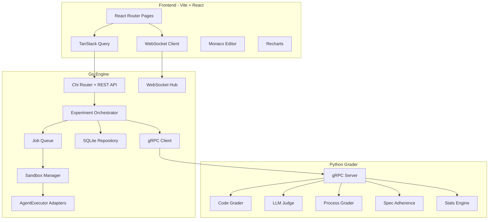
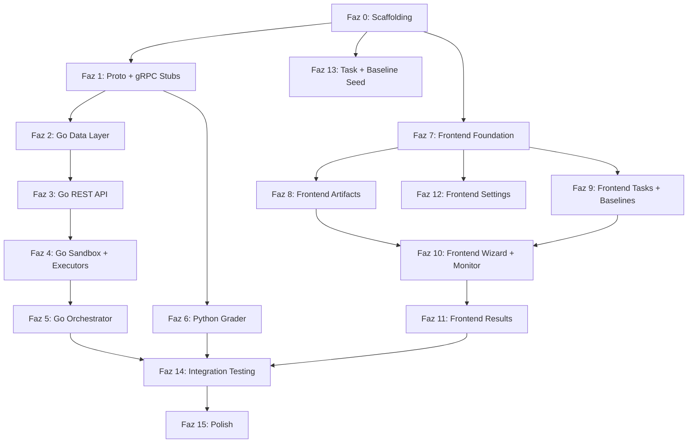

# Frameval Full Implementation Plan

SRS dokümanındaki tüm gereksinimleri kapsayan, sıfırdan implementasyon planı. Proje 3 ana servis (Go Engine, Python Grader, Vite + React Frontend), gRPC ile servisler arası iletişim, Docker sandbox izolasyonu ve 4 katmanlı grading pipeline içeriyor.

## Genel Mimari



---

## Faz 0: Proje Scaffolding ve Altyapı

Tüm proje dizin yapısının, bağımlılık dosyalarının ve Docker yapılandırmalarının oluşturulması.

### Oluşturulacak dosyalar:
- `docker-compose.yml` - 3 servis (frontend, engine, grader) + volume tanımları
- `docker/engine/Dockerfile` - Go engine multi-stage build
- `docker/grader/Dockerfile` - Python grader
- `docker/sandbox/Dockerfile` - Ubuntu 22.04 + Node.js 20 + Python 3.11 + Go 1.22 + git + uv + specify-cli
- `engine/go.mod` - Go 1.22, chi, docker SDK, grpc, sqlite3, testify, uuid
- `engine/cmd/server/main.go` - Entry point
- `grader/pyproject.toml` - Python 3.11+, grpcio, anthropic, openai, instructor, scipy, numpy, pytest
- `grader/server.py` - gRPC server entry
- `frontend/package.json` - Vite, React 19, React Router, shadcn/ui, TanStack Query, Recharts, Monaco Editor
- `frontend/vite.config.ts`, `frontend/tsconfig.json`, `frontend/tailwind.config.ts`, `frontend/index.html`
- `proto/grader.proto` - SRS Section 7.3'teki tam protobuf tanımı
- `proto/buf.yaml`, `proto/buf.gen.yaml` - buf yapılandırması
- `.gitignore` - Go, Python, Node.js, SQLite, .env

---

## Faz 1: Protobuf ve gRPC Stub Oluşturma

- `proto/grader.proto` dosyasının SRS 7.3'teki spesifikasyona uygun yazılması
- `buf generate` ile Go stubs (`engine/proto/`) ve Python stubs (`grader/proto/`) oluşturma
- 3 RPC methodu: `GradeRun`, `ComputeStats`, `ClassifyDimensions`, `HealthCheck`

---

## Faz 2: Go Engine - Veri Katmanı

### Database Migration
- `engine/internal/storage/migrations/001_initial_schema.sql` - SRS Section 6.1'deki tam SQLite şeması (12 tablo + indeksler)

### Domain Modeller
- `engine/internal/models/` - Tüm domain tipleri:
  - `experiment.go` - Experiment, Variant, ArtifactVersion
  - `run.go` - Run, Transcript
  - `grade.go` - Grade, ExperimentStats
  - `task.go` - Task, TestCase
  - `baseline.go` - Baseline
  - `config.go` - APIKey, ModelConfig

### SQLite Repository Katmanı
- `engine/internal/storage/db.go` - DB bağlantısı, migration runner
- `engine/internal/storage/experiment_repo.go` - Experiment CRUD
- `engine/internal/storage/variant_repo.go` - Variant CRUD
- `engine/internal/storage/artifact_repo.go` - ArtifactVersion CRUD
- `engine/internal/storage/run_repo.go` - Run CRUD + status transitions
- `engine/internal/storage/transcript_repo.go` - Transcript storage
- `engine/internal/storage/grade_repo.go` - Grade storage
- `engine/internal/storage/task_repo.go` - Task CRUD
- `engine/internal/storage/baseline_repo.go` - Baseline read + import
- `engine/internal/storage/stats_repo.go` - ExperimentStats storage
- `engine/internal/storage/config_repo.go` - APIKey + ModelConfig

---

## Faz 3: Go Engine - REST API Katmanı

### Router ve Middleware
- `engine/internal/api/router.go` - Chi router, tüm route tanımları
- `engine/internal/api/middleware.go` - Logging, recovery, CORS
- `engine/internal/api/render.go` - JSON response helper (`render.JSON(w, status, payload)`)

### HTTP Handler'lar (SRS Section 7.1)
- `engine/internal/api/experiment_handler.go` - 10 endpoint (CRUD + estimate + start + cancel + stats + export)
- `engine/internal/api/variant_handler.go` - 4 endpoint
- `engine/internal/api/artifact_handler.go` - 5 endpoint (upload, list, get, versions, diff)
- `engine/internal/api/run_handler.go` - 6 endpoint (list, get, transcript, grade, retry, regrade)
- `engine/internal/api/manual_handler.go` - 2 endpoint (package download, transcript upload)
- `engine/internal/api/task_handler.go` - 5 endpoint
- `engine/internal/api/baseline_handler.go` - 5 endpoint
- `engine/internal/api/config_handler.go` - 6 endpoint (models, agents, api-keys)
- `engine/internal/api/system_handler.go` - 3 endpoint (health, docker, queue)

### WebSocket Hub (SRS Section 7.2)
- `engine/internal/api/ws_hub.go` - WebSocket connection management, subscription model
- `engine/internal/api/ws_handler.go` - Upgrade handler, event broadcasting
- Event tipleri: `run.status`, `run.log`, `run.progress`, `experiment.status`, `experiment.complete`, `grading.progress`

---

## Faz 4: Go Engine - Sandbox ve Executor Katmanı

### Docker Sandbox Manager
- `engine/internal/sandbox/manager.go` - Container lifecycle (create, start, wait, collect, destroy)
  - Docker SDK (`github.com/docker/docker/client`)
  - Pre-built sandbox image kullanımı
  - Volume mount: task files + context artifacts
  - Env vars: API keys (asla diske yazılmaz)
  - Network: outbound-only (LLM API allowlist)
  - Resource limits: 2 CPU, 4GB RAM default
  - Timeout context + defer cleanup
  - FS diff: tar snapshot before/after

### AgentExecutor Interface ve Adapter'lar
- `engine/internal/executor/executor.go` - Interface tanımı (SRS 3.8.1)

```go
type AgentExecutor interface {
    Name() string
    SupportedModes() []ExecutionMode
    Execute(ctx context.Context, cfg RunConfig) (*RunResult, error)
    ParseTranscript(raw []byte) (*Transcript, error)
}
```

- `engine/internal/executor/claude.go` - Claude Code adapter (`claude -p "<prompt>" --output-format json`)
- `engine/internal/executor/codex.go` - Codex CLI adapter (`codex --quiet --approval-mode full-auto "<prompt>"`)
- `engine/internal/executor/gemini.go` - Gemini CLI adapter (`echo "<prompt>" | gemini`)
- `engine/internal/executor/api_mode.go` - Direct LLM API adapter (tool-use simulation)
- `engine/internal/executor/manual.go` - Manual transcript upload adapter
- `engine/internal/executor/registry.go` - Adapter registration + discovery

---

## Faz 5: Go Engine - Experiment Orchestrator

### Job Queue
- `engine/internal/experiment/queue.go` - Goroutine pool based job queue
  - Persistent queue (SQLite state ile survive restart)
  - Configurable concurrency (`max_concurrent`, default 3)
  - Run enqueue/dequeue

### Experiment Orchestrator
- `engine/internal/experiment/orchestrator.go` - Experiment lifecycle yönetimi
  - Experiment akışı: create runs -> estimate cost -> start -> enqueue runs -> collect results -> grade -> compute stats
  - Her run: create container -> mount artifacts -> execute agent -> collect artifacts -> destroy container -> grade
  - WebSocket ile real-time status broadcasting
  - Adaptive run allocation (initial n=3, add more based on variance)
  - Adaptive stopping (early termination when p < 0.01)
  - Cancel support (completed runs preserved)
  - Retry support for failed runs

### Cost Estimator
- `engine/internal/experiment/cost.go` - Pre-execution cost estimation
  - Task complexity * model pricing * run count
  - Historical token usage data

### gRPC Client
- `engine/internal/experiment/grader_client.go` - Python grader'a gRPC call wrapper
  - GradeRun, ComputeStats, ClassifyDimensions

---

## Faz 6: Python Grader - Core

### gRPC Server
- `grader/server.py` - gRPC server entry, servis implementasyonu
- `grader/config.py` - Configuration (port, model configs)

### Code Grader (FR-501)
- `grader/code_grader/__init__.py`
- `grader/code_grader/grader.py` - `grade()` fonksiyonu
  - Test runner (pytest, jest, go test -- codebase_type'a gore)
  - Lint (eslint, pylint/ruff, golangci-lint)
  - Type check (tsc, mypy, go vet)
  - File state validation
  - Subprocess calls, deterministic results

### Process Grader (FR-503)
- `grader/process_grader/__init__.py`
- `grader/process_grader/grader.py` - `grade()` fonksiyonu
  - Transcript parsing: turn_count, total_tokens, cost_usd
  - Backtrack detection: file revert, "let me try a different approach", undo
  - Self-validation: test execution, build checks
  - Premature completion: claimed done vs test results
  - Idle turns, error recovery, tool call accuracy, context utilization

### LLM-as-Judge (FR-502)
- `grader/llm_judge/__init__.py`
- `grader/llm_judge/grader.py` - `grade()` fonksiyonu
  - Cross-model judging (Claude agent -> GPT-4o judge)
  - 3x judgment, median score
  - Krippendorff's alpha for IRR
  - `instructor` library ile structured JSON output
  - Pydantic models for judge response
  - 5 dimension: correctness, maintainability, completeness, best_practices, error_handling

### Spec Adherence Grader (FR-504)
- `grader/spec_adherence/__init__.py`
- `grader/spec_adherence/grader.py` - `grade()` fonksiyonu
  - Per-instruction evaluation (followed/violated/na)
  - Cross-model judging
  - 3x judgment, median
  - instruction_compliance, constraint_violations, convention_adherence

### Stats Engine (FR-705)
- `grader/stats/__init__.py`
- `grader/stats/engine.py` - `compute_stats()` fonksiyonu
  - Mann-Whitney U test (scipy.stats.mannwhitneyu)
  - Cohen's d effect size
  - Bootstrap confidence intervals (95%)
  - Power analysis
  - Pairwise comparison for all variant pairs, all metrics

### Composite Score (FR-505)
- `grader/composite.py` - Weighted aggregation
  - Default weights: code=0.3, judge=0.3, process=0.2, adherence=0.2
  - Normalize all scores to [0, 10]

---

## Faz 7: Frontend - Foundation

### Vite + React Setup
- `frontend/index.html` - Vite entry HTML
- `frontend/src/main.tsx` - React root render + providers (TanStack Query, Router)
- `frontend/src/App.tsx` - Root layout (Inter font, dark/light theme) + React Router outlet
- `frontend/src/routes.tsx` - React Router route definitions
- `frontend/src/lib/api.ts` - API client (fetch wrapper, base URL)
- `frontend/src/lib/hooks.ts` - Custom hooks (useWebSocket, etc.)
- `frontend/src/lib/types.ts` - Shared API types (Experiment, Variant, Run, Grade, Task, Baseline, etc.)
- `frontend/src/lib/utils.ts` - Utility functions
- `frontend/src/lib/query-client.tsx` - TanStack Query provider

### shadcn/ui Setup (Vite)
- `npx shadcn@latest init` (Vite + React template ile) + gerekli komponentler:
  - Button, Input, Select, Dialog, Table, Tabs, Card, Badge, Tooltip, Toast, Sheet, Separator, Form, Popover, Command, DropdownMenu, NavigationMenu, Progress, Skeleton

### Layout ve Navigation
- `frontend/src/components/layout/sidebar.tsx` - Ana navigasyon sidebar
- `frontend/src/components/layout/header.tsx` - Sayfa header'ı
- Sayfalar: Dashboard, Artifacts, Experiments, Tasks, Baselines, Settings

---

## Faz 8: Frontend - Artifact Management (FR-100)

- `frontend/src/pages/artifacts/index.tsx` - Artifact listesi (tablo, filtreleme, type/dimension)
- `frontend/src/pages/artifacts/[id].tsx` - Artifact detail + editor
- `frontend/src/components/artifact-editor.tsx` - Monaco editor integration
- `frontend/src/components/artifact-diff.tsx` - Monaco diff view
- `frontend/src/components/dimension-tags.tsx` - Dimension chip/tag gösterimi
- `frontend/src/components/version-timeline.tsx` - Version history timeline
- `frontend/src/components/artifact-upload.tsx` - File/zip upload component
- API hooks: `useArtifacts`, `useArtifact`, `useArtifactVersions`, `useArtifactDiff`

---

## Faz 9: Frontend - Task Library ve Baseline Browser (FR-200, FR-600)

### Task Library
- `frontend/src/pages/tasks/index.tsx` - Task library (card grid, category/complexity filter)
- `frontend/src/pages/tasks/[id].tsx` - Task detail (description, tests, setup script, codebase preview)
- `frontend/src/pages/tasks/new.tsx` - Custom task creation form
- `frontend/src/components/task-card.tsx` - Task card component
- `frontend/src/components/complexity-bar.tsx` - Complexity score visualization

### Baseline Browser
- `frontend/src/pages/baselines/index.tsx` - Baseline list (table, filter by source/task/model)
- `frontend/src/pages/baselines/[id].tsx` - Baseline detail (grade breakdown, artifact content)
- `frontend/src/components/baseline-compare.tsx` - Baseline comparison overlay

---

## Faz 10: Frontend - Experiment Wizard ve Monitoring (FR-300, FR-400)

### Experiment Configuration Wizard (FR-301-305)
- `frontend/src/pages/experiments/index.tsx` - Experiment listesi
- `frontend/src/pages/experiments/new.tsx` - Multi-step wizard
- `frontend/src/components/experiment-wizard/` dizini:
  - `step-name.tsx` - Step 1: Name & description
  - `step-variants.tsx` - Step 2: Variant selection + no-spec control suggestion
  - `step-task.tsx` - Step 3: Task selection
  - `step-agent.tsx` - Step 4: Agent CLI + model selection + execution mode
  - `step-params.tsx` - Step 5: Run parameters + power analysis display
  - `step-baselines.tsx` - Step 6: Baseline selection
  - `step-confirm.tsx` - Step 7: Cost estimate + confirm

### Run Monitor (FR-405)
- `frontend/src/pages/experiments/[id]/monitor.tsx` - Run monitor page
- `frontend/src/components/run-monitor/progress-bar.tsx` - Overall progress
- `frontend/src/components/run-monitor/run-grid.tsx` - Run status cards
- `frontend/src/components/run-monitor/log-viewer.tsx` - Live log streaming (WebSocket)
- `frontend/src/components/run-monitor/cancel-button.tsx`

---

## Faz 11: Frontend - Results Dashboard (FR-700)

- `frontend/src/pages/experiments/[id]/results.tsx` - Results ana sayfası
- `frontend/src/components/results/summary-card.tsx` - Best variant, significance level
- `frontend/src/components/results/comparison-table.tsx` - Variant comparison table (mean +/- CI, color-coded)
- `frontend/src/components/results/heatmap.tsx` - Recharts heatmap (variant x dimension)
- `frontend/src/components/results/scatter-plot.tsx` - Recharts scatter (selectable axes, regression line)
- `frontend/src/components/results/stats-table.tsx` - Full statistical analysis table
- `frontend/src/components/results/transcript-diff.tsx` - Two-pane transcript viewer
- `frontend/src/components/results/dimension-drilldown.tsx` - Box/violin plot modal
- `frontend/src/components/results/export-button.tsx` - JSON/CSV/baseline export

---

## Faz 12: Frontend - Settings (UI 8.1.9)

- `frontend/src/pages/settings/index.tsx` - Settings sayfasi
- `frontend/src/components/settings/api-keys.tsx` - API key management (add/remove, redacted display)
- `frontend/src/components/settings/models.tsx` - Model configurations
- `frontend/src/components/settings/agents.tsx` - Agent CLI availability
- `frontend/src/components/settings/defaults.tsx` - Default experiment parameters

---

## Faz 13: Task Library Seed Data

### Built-in Task'lar (FR-201)
8 task, her biri `tasks/<task-id>/` altında:
- `tasks/jwt-auth-express/` - JWT auth to Express (brownfield, 6.5)
- `tasks/rate-limiter-custom/` - Custom rate limiter (greenfield, 5.0)
- `tasks/bug-fix-async/` - Async race condition fix (bug-fix, 7.0)
- `tasks/refactor-db-layer/` - DB layer extraction (refactor, 8.0)
- `tasks/react-form-validation/` - Form validation (brownfield, 4.0)
- `tasks/cli-tool-go/` - CLI file search tool (greenfield, 5.5)
- `tasks/api-pagination/` - Cursor pagination (brownfield, 6.0)
- `tasks/docker-multi-stage/` - Dockerfile optimization (refactor, 3.5)

Her task icin: `README.md`, `codebase/`, `tests/`, `setup.sh`, `task.json`

### Baseline Seed Data (FR-601)
- `baselines/seed.sql` - Pre-evaluated baseline grades

---

## Faz 14: Integration ve End-to-End Testing

- `engine/internal/api/*_test.go` - Her handler icin table-driven testler
- `engine/internal/storage/*_test.go` - Repository layer testleri
- `engine/internal/experiment/*_test.go` - Orchestrator testleri
- `engine/internal/executor/*_test.go` - Adapter testleri
- `grader/tests/` - Pytest test suite
  - `test_code_grader.py`, `test_process_grader.py`, `test_llm_judge.py`, `test_spec_adherence.py`, `test_stats.py`
  - Recorded fixtures (JSON) for LLM-dependent tests
- `frontend/__tests__/` - Component testleri
- E2E: `docker compose up` -> create experiment -> run -> verify results

---

## Faz 15: Polish ve Production Readiness

- Onboarding wizard (ilk kullanim, experiment yoksa)
- Error handling: tum error mesajlari "what, why, how to fix" formati
- Loading states (Skeleton components)
- Dark/light mode theme toggle
- README.md (setup, quickstart, contributing)
- LICENSE (MIT)
- `.env.example`
- `docker compose up` ile zero-config baslangic dogrulamasi

---

## Implementasyon Sirasi ve Bagimliliklar



**Paralel calismalar:**
- Go Engine (Faz 2-5) ve Python Grader (Faz 6) paralel ilerleyebilir (proto tamamlandiktan sonra)
- Frontend (Faz 7-12) backend'den bagimsiz mock data ile baslatilabilir
- Task seed data (Faz 13) herhangi bir zamanda hazirlanabilir
