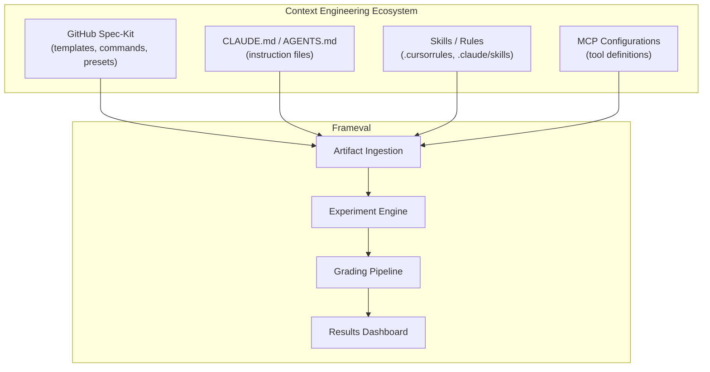
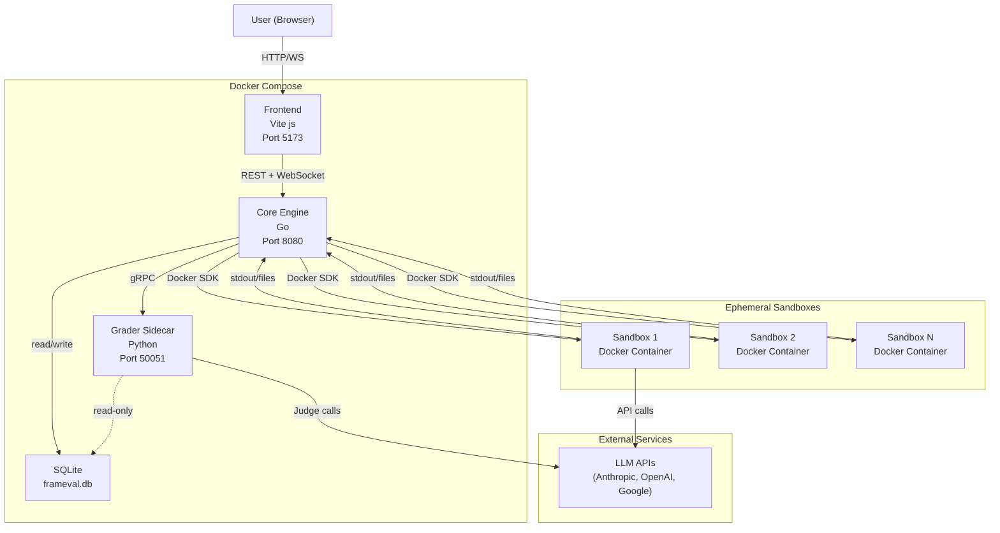
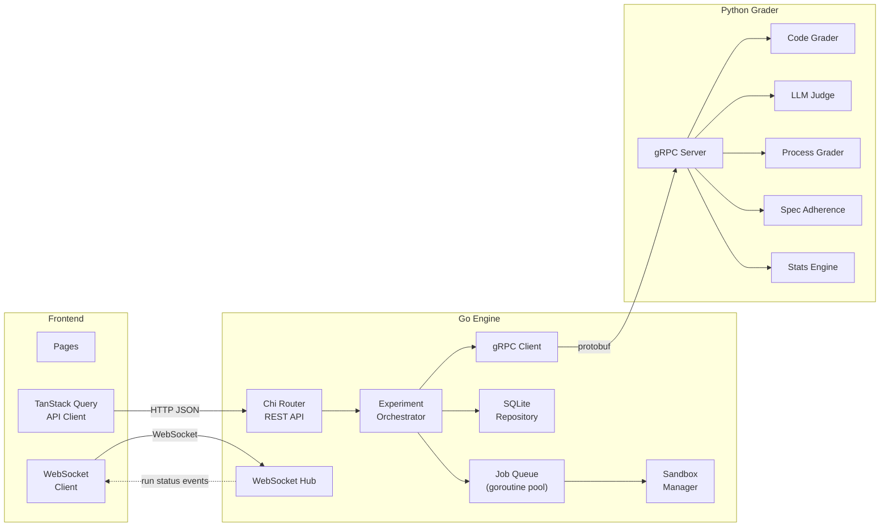
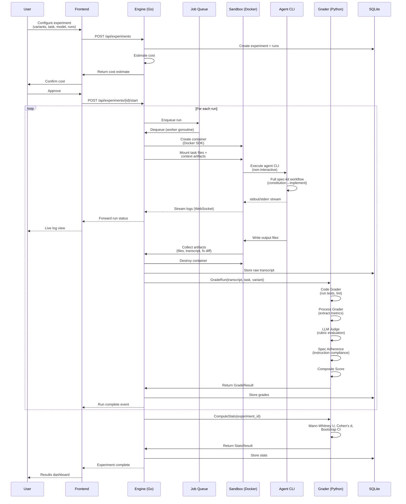
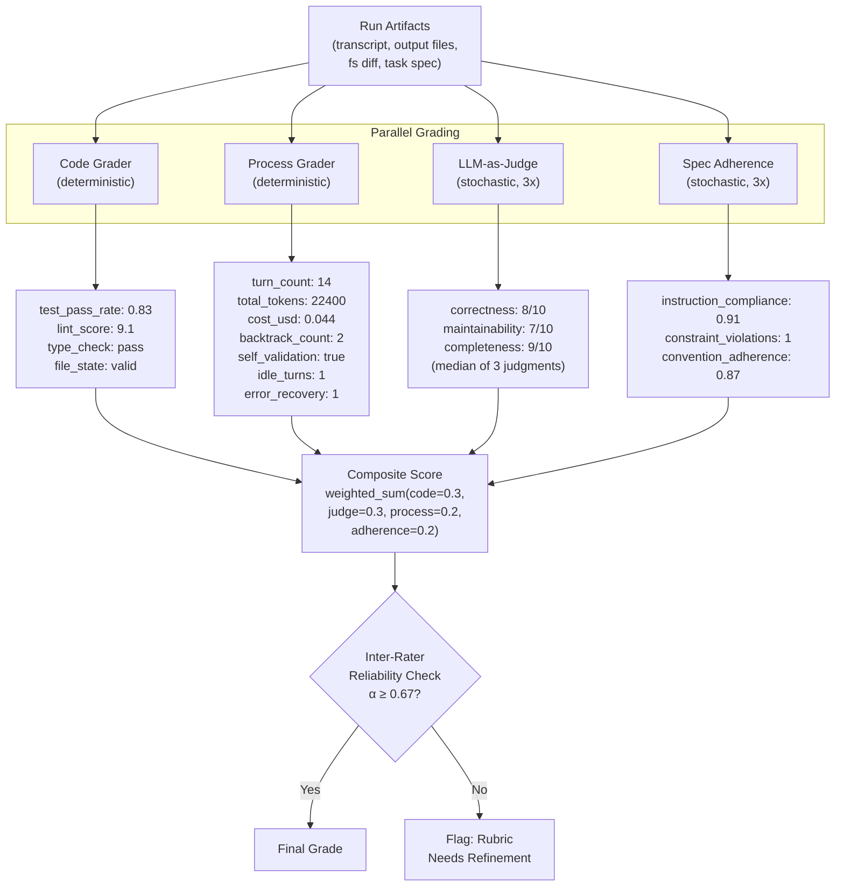
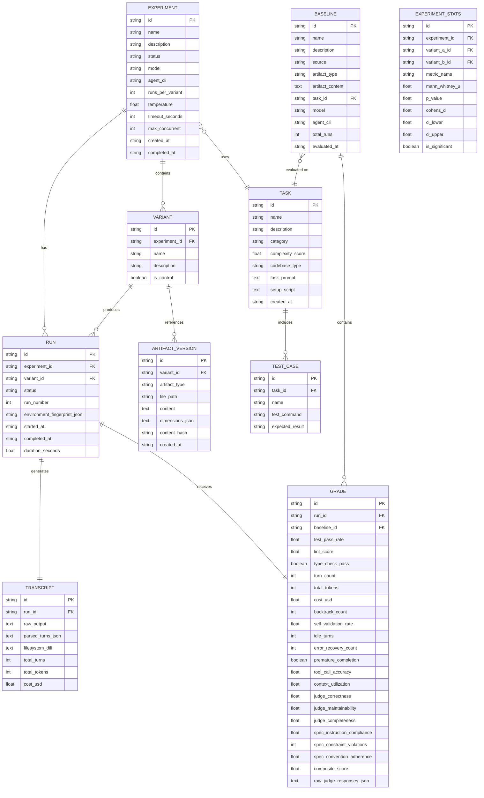
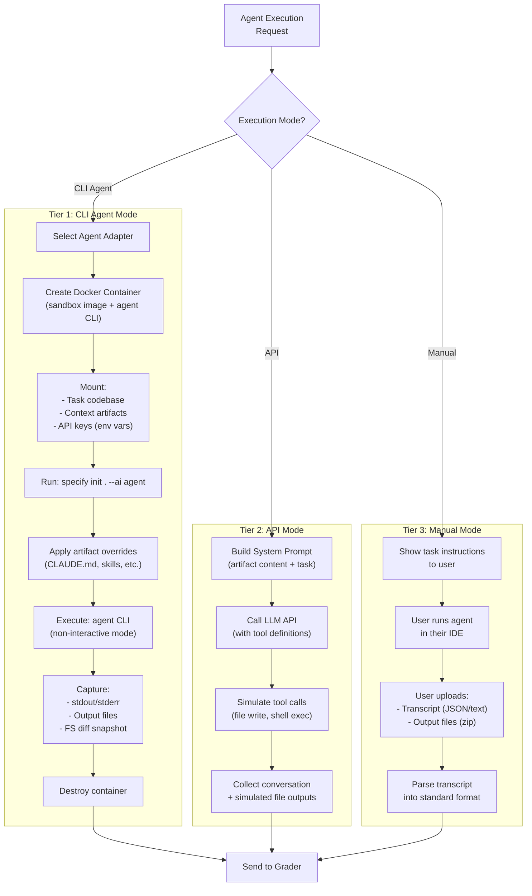
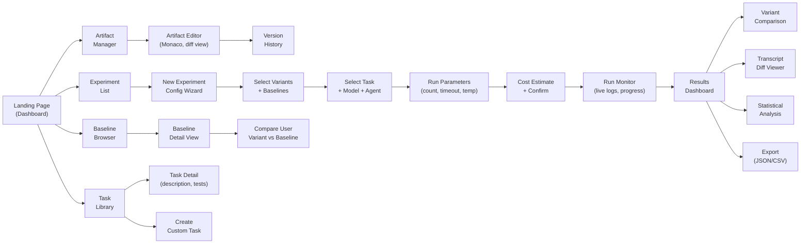

# Software Requirements Specification: Frameval

**Version:** 1.0.0
**Date:** April 8, 2026
**Status:** Draft
**License:** MIT

---

## Table of Contents

1. [Introduction](#1-introduction)
2. [Overall Description](#2-overall-description)
3. [System Architecture](#3-system-architecture)
4. [Functional Requirements](#4-functional-requirements)
5. [Non-Functional Requirements](#5-non-functional-requirements)
6. [Data Model](#6-data-model)
7. [API Specification](#7-api-specification)
8. [UI Specification](#8-ui-specification)

---

## 1. Introduction

### 1.1 Purpose

This Software Requirements Specification (SRS) defines the functional and non-functional requirements for **Frameval**, an open-source, local-first tool for empirically evaluating context engineering artifacts. Frameval enables spec-kit developers, context engineers, and agentic framework researchers to measure the impact of their CLAUDE.md files, AGENTS.md configurations, skills, spec-kit templates, and other context engineering artifacts on AI agent behavior and output quality.

### 1.2 Scope

Frameval is a testing framework for context engineering. Where tools like Jest test code correctness and Lighthouse tests web performance, Frameval tests the quality of instructions given to AI coding agents. It answers the question: **"Does this spec change actually make the agent produce better results?"**

The system accepts context engineering artifacts as input, runs controlled experiments where the artifact is the independent variable, and produces statistically rigorous comparisons of agent performance across variants.

**In scope:**
- Evaluation of all context engineering artifact types (CLAUDE.md, AGENTS.md, .cursorrules, skills, spec-kit templates/commands/extensions/presets, MCP configurations)
- Full spec-kit workflow execution via real agent CLIs in Docker sandboxes
- Direct LLM API evaluation mode for rapid iteration
- Manual transcript upload for IDE-based agents
- Four-layer grading: code quality, LLM-as-Judge, process metrics, spec adherence
- Pre-evaluated baseline library for comparison
- Statistical analysis with significance testing
- Local-first deployment with user-provided API keys

**Out of scope:**
- Hosted SaaS deployment
- Model training or fine-tuning
- General-purpose benchmarking (e.g., HumanEval, SWE-bench)
- IDE plugin development

### 1.3 Definitions, Acronyms, and Abbreviations

| Term | Definition |
|---|---|
| Context Engineering | The discipline of designing the full information environment (instructions, tools, examples, constraints) that guides AI agent behavior |
| Spec-Kit | GitHub's open-source toolkit for Spec-Driven Development, providing templates, commands, and workflows for AI-assisted software development |
| SDD | Spec-Driven Development -- a methodology where specifications drive implementation through AI agents |
| Harness Engineering | Designing the scaffolding (prompts, tools, rules) around an AI agent to control its behavior |
| Variant | A specific version of a context engineering artifact being evaluated in an experiment |
| Baseline | A pre-evaluated reference result (e.g., no-spec, official spec-kit defaults) used for comparison |
| Run | A single execution of an agent with a specific variant on a specific task |
| Experiment | A collection of runs across multiple variants, designed to measure the effect of artifact changes |
| Grader | A component that evaluates the output of an agent run along a specific dimension |
| Transcript | The full record of agent-tool interactions during a run |
| BYOK | Bring Your Own Key -- users provide their own LLM API keys |
| Process Metrics | Measurements of how the agent worked (turns, tokens, backtracking) as opposed to what it produced |

### 1.4 References

- [GitHub Spec-Kit](https://github.com/github/spec-kit) -- The spec-kit ecosystem this tool evaluates
- [IEEE 830-1998](https://standards.ieee.org/standard/830-1998.html) -- SRS formatting standard (inspiration)
- [Anthropic Claude Code CLI](https://docs.anthropic.com/en/docs/claude-code) -- Primary supported agent CLI
- [OpenAI Codex CLI](https://github.com/openai/codex) -- Supported agent CLI
- [Google Gemini CLI](https://github.com/google-gemini/gemini-cli) -- Supported agent CLI

### 1.5 Target Audience

| Audience | Interest |
|---|---|
| Spec-kit developers | Optimize their templates, commands, and presets with empirical data |
| CLAUDE.md / system prompt authors | A/B test instruction variations and measure impact |
| Context engineers | Understand which dimensions of context (framing, examples, structure) matter most |
| Agentic framework researchers | Study how different instruction strategies affect agent process and outcome |
| Open-source contributors | Extend the task library, grading dimensions, and agent adapters |

---

## 2. Overall Description

### 2.1 Product Perspective

Frameval is positioned as **"Jest for context engineering"** -- a testing framework that brings empirical rigor to a space currently driven by intuition.



**Relationship to existing systems:**
- **Spec-Kit**: Frameval evaluates spec-kit artifacts but is not part of spec-kit itself. It consumes spec-kit's output (templates, commands, presets) as test subjects.


### 2.2 User Classes

| User Class | Description | Primary Use Case |
|---|---|---|
| **Spec Author** | Writes CLAUDE.md, AGENTS.md, skills, or spec-kit templates | Upload artifact variants, run experiments, compare results against baselines |
| **Experiment Runner** | Configures and executes evaluation experiments | Design experiments with specific tasks, models, and run counts; analyze statistical results |
| **Baseline Contributor** | Evaluates well-known configurations to expand the baseline library | Run canonical spec-kit configurations through standard tasks and contribute results |
| **Task Author** | Creates new evaluation tasks with test suites | Define coding tasks with complexity scoring, test suites, and expected outcomes |

### 2.3 Operating Environment

- **Host OS**: macOS, Linux, Windows (via WSL2)
- **Required software**: Docker Engine 24+, Docker Compose v2
- **Optional software**: Agent CLIs (claude, gemini, codex) for CLI Agent Mode
- **Hardware**: 8GB+ RAM recommended (Docker containers run concurrently)
- **Network**: Internet access required for LLM API calls during experiment runs
- **Storage**: ~500MB base install + ~1MB per run (transcripts + grades)

### 2.4 Constraints

- **BYOK (Bring Your Own Key)**: Frameval never provides LLM inference. Users must supply their own API keys for the models they want to test with.
- **Local-first storage**: All data (experiments, transcripts, grades, baselines) is stored in a local SQLite database. No cloud sync.
- **Docker dependency**: Sandbox isolation requires Docker. Runs without Docker are not supported for CLI Agent Mode.
- **Agent CLI availability**: CLI Agent Mode requires the user to have the agent CLI installed on their host machine (mounted into the Docker sandbox).
- **Cost responsibility**: Users bear all LLM API costs. The system provides cost estimates before execution but cannot enforce spending limits at the provider level.

### 2.5 Assumptions and Dependencies

- Agent CLIs will maintain their current non-interactive invocation interfaces (`claude -p`, `codex --quiet`, `gemini` with stdin).
- LLM providers will continue offering API access with structured output capabilities.
- Docker container startup time remains under 10 seconds.
- The spec-kit project structure (`.specify/` directory, template format) remains stable across minor versions.

---

## 3. System Architecture

### 3.1 High-Level Architecture

Frameval is composed of three services communicating over well-defined boundaries:



**Service responsibilities:**

| Service | Language | Responsibility |
|---|---|---|
| **Frontend** | TypeScript (Vite) | UI for artifact editing, experiment configuration, run monitoring, results visualization |
| **Core Engine** | Go | REST API, WebSocket hub, experiment orchestration, job queue, Docker sandbox lifecycle, SQLite storage |
| **Grader Sidecar** | Python | Code grading, LLM-as-Judge, process metrics extraction, spec adherence scoring, statistical analysis |
| **Sandboxes** | Docker containers | Isolated agent execution environments with spec-kit and agent CLIs installed |

### 3.2 Service Communication



**Communication protocols:**
- **Frontend <-> Engine**: REST (JSON) for CRUD operations, WebSocket for real-time run status and log streaming
- **Engine <-> Grader**: gRPC with protobuf schemas defined in `proto/grader.proto`
- **Engine <-> Sandboxes**: Docker SDK (Go client) for container lifecycle; volume mounts for file exchange; stdout/stderr streaming for transcript capture

### 3.3 Experiment Execution Flow



### 3.4 Grading Pipeline



**Grader details:**

| Grader | Type | Inputs | Outputs |
|---|---|---|---|
| **Code Grader** | Deterministic | Output files, task test suite | test_pass_rate, lint_score, type_check_pass, file_state_valid |
| **Process Grader** | Deterministic | Transcript | turn_count, total_tokens, cost_usd, backtrack_count, self_validation_rate, idle_turns, error_recovery_count, premature_completion, tool_call_accuracy, context_utilization |
| **LLM-as-Judge** | Stochastic (3x) | Output files, task description, rubric | Per-dimension scores (correctness, maintainability, completeness, etc.) |
| **Spec Adherence** | Stochastic (3x) | Output files, transcript, original spec | instruction_compliance, constraint_violations, convention_adherence |

### 3.5 Data Model (ER Diagram)



### 3.6 Agent Execution Modes



### 3.7 Frontend Page Flow



### 3.8 Resolved Engineering Decisions

The following engineering challenges have been addressed through architectural decisions:

#### 3.8.1 Agent CLI Non-Interactive Execution

All agent CLIs are abstracted behind the `AgentExecutor` interface in Go:

```go
type AgentExecutor interface {
    Name() string
    SupportedModes() []ExecutionMode
    Execute(ctx context.Context, cfg RunConfig) (*RunResult, error)
    ParseTranscript(raw []byte) (*Transcript, error)
}
```

Known non-interactive invocations:
- Claude Code: `claude -p "<prompt>" --output-format json`
- Codex CLI: `codex --quiet --approval-mode full-auto "<prompt>"`
- Gemini CLI: `echo "<prompt>" | gemini`

New agents require only a new adapter implementing this interface.

#### 3.8.2 Cost and Speed Optimization

- **Checkpoint caching**: Intermediate spec-kit workflow results (constitution, spec, plan) are cached. When only the context artifact changes, unchanged stages are skipped.
- **Adaptive run allocation**: Initial n=3 per variant; engine computes variance and allocates additional runs (up to n=10) to high-variance variants.
- **Cost estimator**: Pre-execution cost estimate based on task complexity, model pricing, and historical token usage.
- **Parallel execution**: Up to N sandboxes run concurrently (default N=3) via Go goroutines.

#### 3.8.3 Statistical Validity

- Minimum n=5 enforced in UI with power analysis displayed.
- Mann-Whitney U test (non-parametric), Cohen's d effect size, bootstrap confidence intervals.
- Adaptive stopping: early termination when p < 0.01 with large effect size.
- Automatic no-spec control variant as null hypothesis.
- Dashboard shows confidence intervals with color-coded significance.

#### 3.8.4 LLM Judge Bias Mitigation

- Cross-model judging enforced by default (Claude agent -> GPT-4o judge, and vice versa).
- Each output judged 3 times; Krippendorff's alpha computed for inter-rater reliability.
- Default rubrics use binary/countable criteria, not vague scales.
- Structured JSON output via instructor/structured output APIs.

#### 3.8.5 Reproducibility

- Every run captures an environment fingerprint: Docker image SHA, agent CLI version, model ID, temperature, seed, spec-kit version.
- Raw API responses and CLI output stored verbatim.
- File system snapshots (tar diff) captured before and after each run.
- Temperature=0 by default; seed parameter used when provider supports it.

---

## 4. Functional Requirements

### FR-100: Context Artifact Management

#### FR-101: Artifact Upload and Creation

**Description**: Users can upload or create context engineering artifacts of any supported type.

**Supported artifact types**:

| Type ID | Name | File Pattern | Example |
|---|---|---|---|
| `claude_md` | CLAUDE.md | `CLAUDE.md` | Project-level agent instructions |
| `agents_md` | AGENTS.md | `AGENTS.md` | Agent contribution guide |
| `cursorrules` | Cursor Rules | `.cursorrules`, `.cursor/rules/*.md` | Cursor IDE conventions |
| `skill` | Agent Skill | `.claude/skills/*.md`, `.agents/skills/*.md` | Reusable agent capability |
| `speckit_template` | Spec-Kit Template | `.specify/templates/*.md` | SDD workflow templates |
| `speckit_command` | Spec-Kit Command | `.claude/commands/*.md`, etc. | Slash command definitions |
| `speckit_extension` | Spec-Kit Extension | `extension.yml` + templates | Extension package |
| `speckit_preset` | Spec-Kit Preset | Preset templates + commands | Preset package |
| `speckit_constitution` | Constitution | `.specify/memory/constitution.md` | Project governing principles |
| `mcp_config` | MCP Configuration | `mcp.json`, `.cursor/mcp.json` | Tool server definitions |
| `system_prompt` | System Prompt | Free text | Raw system prompt text |
| `composite` | Composite Bundle | Directory / zip | Multiple artifacts bundled |

**Acceptance criteria**:
- User can create a new artifact by pasting text into an editor
- User can upload a file or directory (zip) as an artifact
- Artifact type is auto-detected from file name/content but can be overridden
- Artifacts are stored with content hash for deduplication

#### FR-102: Artifact Versioning

**Description**: Every artifact edit creates a new version. Users can view version history and diff between versions.

**Acceptance criteria**:
- Each save creates a new `ARTIFACT_VERSION` record with content hash
- Diff view shows line-by-line changes between any two versions (Monaco diff editor)
- Versions are immutable once created
- User can restore any previous version as the current version

#### FR-103: Artifact Dimension Detection

**Description**: The system automatically analyzes each artifact and classifies it along a taxonomy of dimensions.

**Dimension taxonomy**:

| Dimension | Values | Description |
|---|---|---|
| `framing` | positive, negative, neutral, mixed | How constraints are expressed |
| `specificity` | abstract, concrete, example_driven, mixed | Level of detail in instructions |
| `structure` | flat_list, hierarchical, narrative, tabular | Organization of the artifact |
| `scope` | broad, narrow, task_specific | How wide the instructions apply |
| `tone` | imperative, advisory, conversational | Voice of the instructions |
| `constraint_density` | float (rules per 100 tokens) | How densely packed the rules are |
| `example_presence` | none, good_only, good_and_bad, inline | Whether examples are provided |
| `priority_signaling` | explicit, implicit, none | Whether priorities are ordered |
| `tool_guidance` | none, general, specific | Instructions about tool usage |
| `error_handling` | none, general, specific | Instructions about error recovery |

**Acceptance criteria**:
- Dimensions are computed automatically when an artifact is created or updated
- Dimension values are stored as JSON in `ARTIFACT_VERSION.dimensions_json`
- Dashboard can filter and group variants by dimension values
- Dimension detection uses an LLM call (via grader sidecar) with a structured output schema

#### FR-104: Spec-Kit Extension and Preset Support

**Description**: Users can upload entire spec-kit extensions or presets as evaluable artifacts. The system understands their structure (templates, commands, config).

**Acceptance criteria**:
- Extension packages (directory with `extension.yml` + templates + commands) can be uploaded as a zip
- Preset packages (template overrides + command overrides) can be uploaded as a zip
- The system parses `extension.yml` / preset config and displays the components
- Individual components (templates, commands) can be viewed and compared

### FR-200: Task Library

#### FR-201: Built-in Tasks

**Description**: Frameval ships with a curated set of evaluation tasks spanning different categories and complexity levels.

**Initial task library**:

| Task ID | Name | Category | Complexity | Codebase |
|---|---|---|---|---|
| `jwt-auth-express` | Add JWT auth to Express app | brownfield | 6.5 | Node.js/Express |
| `rate-limiter-custom` | Build custom rate limiter | greenfield | 5.0 | Node.js |
| `bug-fix-async` | Fix async race condition | bug-fix | 7.0 | Python/FastAPI |
| `refactor-db-layer` | Extract DB layer from monolith | refactor | 8.0 | Python/SQLAlchemy |
| `react-form-validation` | Add form validation | brownfield | 4.0 | React/TypeScript |
| `cli-tool-go` | Build CLI file search tool | greenfield | 5.5 | Go |
| `api-pagination` | Add cursor pagination to REST API | brownfield | 6.0 | Node.js/Express |
| `docker-multi-stage` | Optimize Dockerfile | refactor | 3.5 | Docker |

**Acceptance criteria**:
- Each task includes: description, starter codebase (if brownfield), test suite, setup script, complexity score
- Tasks are stored in `tasks/` directory with a standard structure
- Task list is displayed in the UI with filtering by category and complexity

#### FR-202: Task Complexity Scoring

**Description**: Each task has a complexity score (1-10) based on objective criteria.

**Scoring dimensions**:
- File count (multi-file vs single-file): 0-2 points
- Existing code interaction (greenfield=0, brownfield=2): 0-2 points
- Domain knowledge requirement: 0-2 points
- Ambiguity level (single correct approach=0, many valid=2): 0-2 points
- Test suite strictness: 0-2 points

**Acceptance criteria**:
- Complexity score is computed from the 5 dimensions above
- Score is displayed in task selection UI
- Users can filter tasks by complexity range

#### FR-203: Custom Task Creation

**Description**: Users can create custom evaluation tasks.

**Acceptance criteria**:
- User provides: task name, description, prompt, category, codebase type
- User can upload a starter codebase (zip)
- User can define test cases (command + expected result)
- Custom tasks appear alongside built-in tasks in the task selector
- Setup script can install dependencies and prepare the environment

### FR-300: Experiment Configuration

#### FR-301: Variant Selection

**Description**: Users select which artifact variants to compare in an experiment.

**Acceptance criteria**:
- User can select 2-10 artifact versions as variants
- One variant can be marked as "control" (e.g., no-spec baseline)
- System suggests adding a no-spec control if none is selected
- Each variant shows its dimension classification for easy comparison

#### FR-302: Model and Agent Selection

**Description**: Users select the LLM model and agent CLI for the experiment.

**Supported models** (extensible):

| Provider | Models |
|---|---|
| Anthropic | claude-sonnet-4-20250514, claude-opus-4-20250918 |
| OpenAI | gpt-4o, gpt-4.1, o3 |
| Google | gemini-2.5-pro, gemini-2.5-flash |

**Supported agent CLIs** (extensible):

| CLI | Non-Interactive Command | Status |
|---|---|---|
| `claude` | `claude -p "<prompt>" --output-format json` | Fully supported |
| `codex` | `codex --quiet --approval-mode full-auto "<prompt>"` | Fully supported |
| `gemini` | `echo "<prompt>" \| gemini` | Fully supported |
| API Mode | Direct HTTP to LLM API | Always available |
| Manual | User runs + uploads transcript | Always available |

**Acceptance criteria**:
- Model selection is a dropdown populated from a config file
- Agent CLI selection shows availability status (installed/not installed)
- API Mode and Manual Mode are always available regardless of CLI installation
- User can add custom model identifiers

#### FR-303: Run Count Configuration

**Description**: Users set the number of runs per variant.

**Acceptance criteria**:
- Minimum value: 5 (enforced in UI)
- Default value: 5
- UI shows power analysis: expected statistical power for the chosen n and expected effect size
- Recommendation shown: "For reliable results, we recommend n=8+ (power > 0.80 for medium effect size)"

#### FR-304: Baseline Selection

**Description**: Users select pre-evaluated baselines to compare against.

**Acceptance criteria**:
- Baseline browser shows all available baselines filtered by task
- Each baseline displays: source (no-spec, official, community), summary statistics, date evaluated
- Selected baselines appear alongside user variants in results
- No additional runs are needed for baselines (data is pre-computed)

#### FR-305: Execution Parameters

**Description**: Users configure runtime parameters.

| Parameter | Default | Range | Description |
|---|---|---|---|
| `timeout_seconds` | 600 | 60-1800 | Max wall-clock time per run |
| `temperature` | 0.0 | 0.0-1.0 | LLM temperature (0 = most deterministic) |
| `max_concurrent` | 3 | 1-10 | Parallel sandbox count |
| `judge_model` | (auto: cross-model) | any supported model | Model used for LLM-as-Judge |
| `seed` | null | integer or null | Random seed (when provider supports it) |

**Acceptance criteria**:
- All parameters have sensible defaults
- Cost estimate updates in real-time as parameters change
- Temperature=0 warning shown if user increases it ("Higher temperature reduces reproducibility")

### FR-400: Experiment Execution

#### FR-401: Docker Sandbox Management

**Description**: Each run executes in an isolated Docker container.

**Container specification**:
- Base image: Ubuntu 22.04 with Python 3.11+, Node.js 20+, Go 1.22+, git, uv
- Spec-kit: Pre-installed via `uv tool install specify-cli`
- Agent CLI: Mounted from host or installed in image
- Resources: Configurable CPU/memory limits (default: 2 CPU, 4GB RAM)
- Network: Outbound internet allowed (for LLM API calls), no inbound
- Lifetime: Created at run start, destroyed at run end

**Acceptance criteria**:
- Container starts within 10 seconds (pre-built image)
- Container is destroyed even if the run crashes or times out
- File system state is captured before and after execution
- API keys are passed as environment variables (never written to disk inside container)

#### FR-402: Context Artifact Application

**Description**: The selected variant's artifacts are applied to the sandboxed project.

**Acceptance criteria**:
- Artifacts are written to their canonical paths (e.g., `CLAUDE.md` in project root)
- For composite artifacts, the entire directory structure is replicated
- For spec-kit extensions/presets, they are installed via `specify extension add` / `specify preset add`
- A manifest of applied artifacts is logged for reproducibility

#### FR-403: Full Workflow Execution

**Description**: The agent runs the complete spec-kit workflow.

**Default workflow stages**:
1. `specify init . --ai <agent>` (if not already initialized)
2. Constitution application (from artifact)
3. `/speckit.specify` with task prompt
4. `/speckit.plan` with task technical details
5. `/speckit.tasks` to generate task breakdown
6. `/speckit.implement` to execute implementation

**Acceptance criteria**:
- Each stage is logged with timestamps
- Stage failures are captured and reported (partial runs are still graded)
- Checkpoint caching: if a previous run completed stages 1-3 with identical inputs, those stages can be skipped
- The full agent transcript is captured for all stages

#### FR-404: Execution Modes

**Description**: Three execution modes are supported.

**Tier 1 -- CLI Agent Mode**:
- Runs agent CLI in Docker sandbox
- Fully automated, no user interaction needed
- Requires agent CLI available on host

**Tier 2 -- API Mode**:
- Builds system prompt from artifact content + task prompt
- Calls LLM API directly with tool-use simulation
- Tools simulated: file_write, file_read, shell_exec, search
- Faster and cheaper than CLI mode
- Does not test agent-specific behaviors (tool selection, multi-turn strategy)

**Tier 3 -- Manual Mode**:
- System displays task instructions to the user
- User runs their agent (any agent, any IDE) and exports:
  - Transcript (JSON format or raw text)
  - Output files (zip upload)
- System parses transcript into standard format and grades it

**Acceptance criteria**:
- Mode is selected per-experiment
- API Mode runs complete in < 2 minutes per run
- Manual Mode provides a downloadable task package (instructions + starter code)
- Transcript parser handles Claude Code JSON, Cursor export, and raw text formats

#### FR-405: Real-Time Monitoring

**Description**: Users can monitor running experiments in real time.

**Acceptance criteria**:
- WebSocket connection streams run status events (queued, running, completed, failed)
- Live log view shows agent stdout/stderr as it executes
- Progress bar shows completed/total runs
- Individual runs can be inspected while experiment is still running
- User can cancel remaining runs (completed runs are preserved)

#### FR-406: Job Queue

**Description**: Experiment runs are managed by a job queue with concurrency control.

**Acceptance criteria**:
- Runs are enqueued in order (variant A run 1, variant A run 2, ..., variant B run 1, ...)
- Up to `max_concurrent` runs execute in parallel
- Queue is persistent (survives engine restart via SQLite state)
- Failed runs can be retried individually
- Queue depth and worker status visible in UI

#### FR-407: Artifact Collection

**Description**: After each run, all artifacts are collected for grading.

**Collected artifacts**:
- Raw transcript (stdout/stderr of agent CLI)
- Parsed transcript (structured turns with role, content, tool calls)
- Output files (all files created or modified by the agent)
- File system diff (before/after snapshot)
- Timing data (stage durations, total wall clock time)
- Token usage (extracted from transcript or API response)
- Environment fingerprint (Docker image SHA, CLI version, model ID, etc.)

**Acceptance criteria**:
- All artifacts are stored in SQLite (transcripts) and filesystem (large files)
- Artifacts are immutable after collection
- Re-grading can be done without re-running (all inputs preserved)

### FR-500: Grading Engine

#### FR-501: Code Grader

**Description**: Deterministic evaluation of the agent's code output.

**Metrics**:

| Metric | Type | Description |
|---|---|---|
| `test_pass_rate` | float [0,1] | Fraction of task test cases that pass |
| `test_pass_count` | int | Number of passing tests |
| `test_fail_count` | int | Number of failing tests |
| `lint_score` | float [0,10] | Aggregated lint score (ESLint, pylint, golangci-lint depending on task) |
| `type_check_pass` | bool | Whether type checking passes (TypeScript tsc, Python mypy, Go vet) |
| `file_state_valid` | bool | Whether expected files exist with expected structure |

**Acceptance criteria**:
- Tests are run inside the sandbox container (language-appropriate test runner)
- Lint and type check tools are pre-installed in the sandbox image
- Results are deterministic for the same output files
- Partial credit: test_pass_rate = passed / total (not all-or-nothing)

#### FR-502: LLM-as-Judge

**Description**: LLM-based evaluation using structured rubrics.

**Default rubric dimensions**:

| Dimension | Scale | Criteria |
|---|---|---|
| `correctness` | 1-10 | Does the code correctly implement the task requirements? |
| `maintainability` | 1-10 | Is the code well-structured, readable, and maintainable? |
| `completeness` | 1-10 | Are all requirements addressed, including edge cases? |
| `best_practices` | 1-10 | Does the code follow language/framework best practices? |
| `error_handling` | 1-10 | Are errors handled appropriately? |

**Acceptance criteria**:
- Cross-model judging: if agent model is Claude, judge model is GPT-4o (and vice versa)
- Each output is judged 3 times; median score used
- Krippendorff's alpha computed across the 3 judgments; alpha < 0.67 flags the rubric
- Judge receives: output files, task description, rubric, but NOT the agent transcript (to avoid judging process instead of output)
- Structured JSON output enforced via instructor library
- Custom rubrics can be defined per task or per experiment

#### FR-503: Process Grader

**Description**: Deterministic extraction of process metrics from the agent transcript.

**Metrics**:

| Metric | Type | Description |
|---|---|---|
| `turn_count` | int | Total conversation turns |
| `total_tokens` | int | Total tokens consumed (input + output) |
| `cost_usd` | float | Estimated cost based on model pricing |
| `token_efficiency` | float | composite_score / total_tokens (quality per token) |
| `backtrack_count` | int | Times the agent reversed a previous decision |
| `self_validation_rate` | float [0,1] | Fraction of outputs the agent tested/verified itself |
| `premature_completion` | bool | Agent declared done before all requirements met |
| `idle_turns` | int | Turns where agent "thought" but took no action |
| `error_recovery_count` | int | Times agent encountered an error and recovered |
| `tool_call_accuracy` | float [0,1] | Fraction of tool calls that succeeded |
| `context_utilization` | float [0,1] | How much of the available context the agent referenced |

**Acceptance criteria**:
- All metrics are extracted from the parsed transcript (no LLM call needed)
- Backtracking detected by: file revert, explicit "let me try a different approach", undo operations
- Self-validation detected by: test execution, manual verification statements, build checks
- Premature completion detected by: comparing claimed completion against test results

#### FR-504: Spec Adherence Grader

**Description**: LLM-based evaluation of whether the agent followed the instructions in the context artifact.

**Metrics**:

| Metric | Type | Description |
|---|---|---|
| `instruction_compliance` | float [0,1] | Fraction of explicit instructions that were followed |
| `constraint_violations` | int | Number of explicit constraints that were violated |
| `convention_adherence` | float [0,1] | Adherence to naming, style, and structural conventions |

**Acceptance criteria**:
- Grader receives: the context artifact content, the agent transcript, and the output files
- Each instruction/constraint in the artifact is evaluated individually
- Results include a per-instruction breakdown (followed / violated / not applicable)
- Cross-model judging applies (same as LLM-as-Judge)

#### FR-505: Composite Score

**Description**: Weighted aggregation of all grader scores.

**Default weights**:
- Code Grader: 0.30
- LLM-as-Judge: 0.30
- Process Grader: 0.20
- Spec Adherence: 0.20

**Acceptance criteria**:
- Weights are configurable per experiment
- Composite score is a float [0, 10]
- Individual grader scores are normalized to [0, 10] before weighting
- Composite score formula: `sum(weight_i * normalized_score_i)`

#### FR-506: Cross-Model Judge Configuration

**Description**: The judge model is automatically selected to differ from the agent model.

**Default mapping**:

| Agent Model Provider | Judge Model |
|---|---|
| Anthropic (Claude) | gpt-4o |
| OpenAI (GPT) | claude-sonnet-4-20250514 |
| Google (Gemini) | claude-sonnet-4-20250514 |

**Acceptance criteria**:
- Default mapping is applied automatically
- User can override the judge model in experiment settings
- Warning shown if user selects same provider for agent and judge

### FR-600: Baseline Library

#### FR-601: Pre-Evaluated Baselines

**Description**: Frameval ships with pre-evaluated baseline results for common configurations.

**Baseline categories**:

| Category | Description | Examples |
|---|---|---|
| **Control** | No context artifact at all | Bare model, no CLAUDE.md or spec-kit |
| **Official** | GitHub spec-kit default configuration | Default templates, no extensions/presets |
| **Community** | Popular community configurations | Ralph Loop, MAQA, Canon, AIDE |
| **Custom** | Purpose-built reference configurations | Minimal spec, verbose spec, example-driven spec |

**Acceptance criteria**:
- Baseline data is included in the application package (`baselines/seed.sql`)
- Each baseline includes: configuration description, task, model, agent, total runs, all grade dimensions
- Baselines are loaded on first startup (SQLite seed)
- Users cannot modify baselines (read-only)

#### FR-602: Baseline Comparison

**Description**: Any user variant can be compared against any baseline.

**Acceptance criteria**:
- Comparison view shows user variant vs baseline side-by-side
- Statistical significance is computed between user variant runs and baseline runs
- Comparison available for all grade dimensions independently
- Chart overlay: user variant distribution vs baseline distribution

#### FR-603: Baseline Contribution

**Description**: Users can contribute their evaluation results as new baselines.

**Acceptance criteria**:
- Export function generates a baseline package (JSON) from a completed experiment
- Package includes: artifact content, task ID, model, agent, all grades, stats
- Contribution workflow: export -> submit to community repo (GitHub PR)
- Imported baselines appear in the baseline browser

### FR-700: Results Dashboard

#### FR-701: Variant Comparison View

**Description**: Side-by-side comparison of all variants in an experiment.

**Acceptance criteria**:
- Table view: rows = metrics, columns = variants, cells = mean +/- CI
- Color coding: significantly better (green), worse (red), no significant difference (gray)
- Sortable by any metric
- Click on cell to drill down to individual run values

#### FR-702: Heatmap Visualization

**Description**: Matrix heatmap of variants vs. grade dimensions.

**Acceptance criteria**:
- X-axis: grade dimensions (test_pass_rate, judge_correctness, turn_count, etc.)
- Y-axis: variants (including baselines)
- Cell color: normalized score intensity
- Hover shows exact value and confidence interval
- Built with Recharts

#### FR-703: Scatter Plot

**Description**: Correlation visualization between any two metrics.

**Acceptance criteria**:
- User selects X and Y axis from any available metric
- Points colored by variant
- Regression line with R-squared displayed
- Recommended preset: token_efficiency vs. composite_score
- Interactive: click point to view run details

#### FR-704: Transcript Diff Viewer

**Description**: Side-by-side comparison of two run transcripts.

**Acceptance criteria**:
- Left/right pane shows two transcripts (from different variants, same task)
- Divergence points highlighted (where agents made different decisions)
- Turn-by-turn alignment with tool call matching
- Filterable by: all turns, tool calls only, text only

#### FR-705: Statistical Analysis View

**Description**: Detailed statistical results for the experiment.

**Acceptance criteria**:
- Per-metric comparison table with: mean, median, std, Mann-Whitney U, p-value, Cohen's d, 95% CI
- Significance thresholds: p < 0.05 (significant), p < 0.01 (highly significant)
- Effect size interpretation: small (d < 0.2), medium (0.2-0.8), large (d > 0.8)
- Power analysis: observed power and recommendation for additional runs if underpowered
- Adaptive stopping indicator: "Early stopped at n=6 (p < 0.001, d = 1.4)"

#### FR-706: Export

**Description**: Export experiment results.

**Supported formats**:
- JSON (full experiment data including transcripts)
- CSV (summary statistics only)
- Baseline package (for contribution)

**Acceptance criteria**:
- Export button on results dashboard
- JSON export includes all runs, grades, stats, and artifact content
- CSV export has one row per variant with summary statistics

#### FR-707: Dimension Drill-Down

**Description**: Explore why a variant scored differently on a specific dimension.

**Acceptance criteria**:
- Click on any metric cell to see individual run values for that metric
- Box plot or violin plot showing distribution per variant
- Link to relevant transcript sections that contributed to the score
- For LLM-Judge dimensions: show the judge's reasoning text

### FR-800: Context Artifact Analyzer

#### FR-801: Dimension Classification

**Description**: Automatically classify artifacts along the dimension taxonomy (defined in FR-103).

**Acceptance criteria**:
- Classification runs automatically on artifact creation/update
- Results stored in `ARTIFACT_VERSION.dimensions_json`
- Classification uses LLM call with structured output
- Dimensions displayed as tags in the artifact list view

#### FR-802: Dimension Diff

**Description**: When comparing two artifact versions, show which dimensions changed.

**Acceptance criteria**:
- Side-by-side view shows text diff AND dimension diff
- Changed dimensions are highlighted with old/new values
- Helps users understand "what changed structurally" not just "what text changed"

#### FR-803: Correlation Analysis

**Description**: Analyze which dimension changes correlate with which metric changes.

**Acceptance criteria**:
- After multiple experiments, the system can identify patterns (e.g., "positive framing correlates with +12% test_pass_rate across 5 experiments")
- Correlation computed between dimension values and grade metrics
- Displayed as a correlation matrix with significance indicators
- Requires minimum 3 experiments with dimension variation to produce results

---

## 5. Non-Functional Requirements

### NFR-1: Performance

| Metric | Target | Notes |
|---|---|---|
| Dashboard page load | < 2 seconds | For experiments with up to 100 runs |
| API response (list/read) | < 200ms | Excluding grading operations |
| Container startup | < 10 seconds | Pre-built sandbox image |
| Single run timeout | Configurable (default 600s) | Hard kill at timeout |
| Concurrent sandboxes | Up to 10 | Configurable, default 3 |
| gRPC grading latency | < 5 seconds for deterministic graders | LLM graders depend on API latency |
| WebSocket event delivery | < 500ms from event to UI update | For run status changes |

### NFR-2: Reproducibility

| Requirement | Implementation |
|---|---|
| Environment fingerprinting | Every run records: Docker image SHA, agent CLI version, model ID, temperature, seed, spec-kit version, OS, timestamp |
| Response archival | Raw API responses and CLI output stored verbatim in transcript store |
| Determinism defaults | Temperature=0, seed parameter when supported |
| Snapshot diffing | File system tar snapshots before/after each run, stored as compressed diffs |
| Re-gradability | All grading inputs preserved; re-grading never requires re-running the agent |
| Reproducibility score | Dashboard displays cross-run variance metric for identical configurations |

### NFR-3: Security

| Requirement | Implementation |
|---|---|
| API key isolation | Keys passed as environment variables to containers; never written to disk inside sandbox |
| Key storage | Keys stored in local config file with 0600 permissions; never committed to SQLite |
| Container isolation | Each sandbox runs with `--network=none` except for LLM API endpoints (allowlist) |
| No telemetry | Zero external data transmission; fully air-gapped operation |
| No key logging | API keys are redacted from all transcripts and logs |
| Input sanitization | All user inputs validated before Docker commands or SQL queries |

### NFR-4: Extensibility

| Extension Point | Mechanism |
|---|---|
| New agent CLI | Implement `AgentExecutor` Go interface + register in adapter registry |
| New grader dimension | Implement gRPC grader service method + add to protobuf schema |
| New task | Add directory to `tasks/` with standard structure (README, codebase, tests) |
| New model | Add to models config file (provider, model ID, pricing) |
| New artifact type | Add to artifact type registry (ID, file pattern, parser) |
| Custom rubric | Define JSON rubric with dimensions and criteria; pass to LLM-Judge |

### NFR-5: Storage

| Metric | Target |
|---|---|
| Base install size | < 500MB (including Docker images) |
| Per-run storage | ~1MB average (transcript + grades + metadata) |
| 1000-run capacity | < 1.5GB total database size |
| Baseline seed data | < 50MB |
| Transcript storage | Compressed text in SQLite (large transcripts as external files) |
| Backup | Single file backup (SQLite `frameval.db` + transcripts directory) |

### NFR-6: Usability

| Requirement | Implementation |
|---|---|
| Zero configuration start | `docker compose up` starts all services with defaults |
| First experiment guidance | Onboarding wizard walks through first experiment setup |
| Cost transparency | Cost estimate shown before every experiment execution |
| Error messages | All errors include: what happened, why, and how to fix |
| Documentation | In-app help for every configuration option |

---

## 6. Data Model

### 6.1 SQLite Schema

```sql
-- Core experiment tables

CREATE TABLE experiments (
    id TEXT PRIMARY KEY,
    name TEXT NOT NULL,
    description TEXT,
    status TEXT NOT NULL DEFAULT 'draft'
        CHECK (status IN ('draft', 'estimating', 'ready', 'running', 'completed', 'failed', 'cancelled')),
    task_id TEXT NOT NULL REFERENCES tasks(id),
    model TEXT NOT NULL,
    agent_cli TEXT NOT NULL,
    execution_mode TEXT NOT NULL DEFAULT 'cli'
        CHECK (execution_mode IN ('cli', 'api', 'manual')),
    runs_per_variant INTEGER NOT NULL DEFAULT 5 CHECK (runs_per_variant >= 5),
    temperature REAL NOT NULL DEFAULT 0.0,
    timeout_seconds INTEGER NOT NULL DEFAULT 600,
    max_concurrent INTEGER NOT NULL DEFAULT 3,
    judge_model TEXT,
    seed INTEGER,
    estimated_cost_usd REAL,
    actual_cost_usd REAL,
    composite_weights_json TEXT NOT NULL DEFAULT '{"code":0.3,"judge":0.3,"process":0.2,"adherence":0.2}',
    created_at TEXT NOT NULL DEFAULT (strftime('%Y-%m-%dT%H:%M:%SZ', 'now')),
    started_at TEXT,
    completed_at TEXT
);

CREATE TABLE variants (
    id TEXT PRIMARY KEY,
    experiment_id TEXT NOT NULL REFERENCES experiments(id) ON DELETE CASCADE,
    name TEXT NOT NULL,
    description TEXT,
    is_control INTEGER NOT NULL DEFAULT 0,
    ordering INTEGER NOT NULL DEFAULT 0
);

CREATE TABLE artifact_versions (
    id TEXT PRIMARY KEY,
    variant_id TEXT NOT NULL REFERENCES variants(id) ON DELETE CASCADE,
    artifact_type TEXT NOT NULL,
    file_path TEXT NOT NULL,
    content TEXT NOT NULL,
    content_hash TEXT NOT NULL,
    dimensions_json TEXT,
    created_at TEXT NOT NULL DEFAULT (strftime('%Y-%m-%dT%H:%M:%SZ', 'now'))
);

CREATE TABLE runs (
    id TEXT PRIMARY KEY,
    experiment_id TEXT NOT NULL REFERENCES experiments(id) ON DELETE CASCADE,
    variant_id TEXT NOT NULL REFERENCES variants(id) ON DELETE CASCADE,
    run_number INTEGER NOT NULL,
    status TEXT NOT NULL DEFAULT 'pending'
        CHECK (status IN ('pending', 'queued', 'running', 'grading', 'completed', 'failed', 'cancelled', 'timeout')),
    container_id TEXT,
    environment_fingerprint_json TEXT,
    started_at TEXT,
    completed_at TEXT,
    duration_seconds REAL,
    error_message TEXT,
    UNIQUE(experiment_id, variant_id, run_number)
);

CREATE TABLE transcripts (
    id TEXT PRIMARY KEY,
    run_id TEXT NOT NULL UNIQUE REFERENCES runs(id) ON DELETE CASCADE,
    raw_output TEXT NOT NULL,
    parsed_turns_json TEXT,
    filesystem_diff TEXT,
    total_turns INTEGER,
    total_tokens INTEGER,
    cost_usd REAL,
    output_files_path TEXT
);

CREATE TABLE grades (
    id TEXT PRIMARY KEY,
    run_id TEXT REFERENCES runs(id) ON DELETE CASCADE,
    baseline_id TEXT REFERENCES baselines(id) ON DELETE CASCADE,
    -- Code grader
    test_pass_rate REAL,
    test_pass_count INTEGER,
    test_fail_count INTEGER,
    lint_score REAL,
    type_check_pass INTEGER,
    file_state_valid INTEGER,
    -- Process grader
    turn_count INTEGER,
    total_tokens INTEGER,
    cost_usd REAL,
    token_efficiency REAL,
    backtrack_count INTEGER,
    self_validation_rate REAL,
    premature_completion INTEGER,
    idle_turns INTEGER,
    error_recovery_count INTEGER,
    tool_call_accuracy REAL,
    context_utilization REAL,
    -- LLM Judge
    judge_correctness REAL,
    judge_maintainability REAL,
    judge_completeness REAL,
    judge_best_practices REAL,
    judge_error_handling REAL,
    judge_irr_alpha REAL,
    raw_judge_responses_json TEXT,
    -- Spec Adherence
    spec_instruction_compliance REAL,
    spec_constraint_violations INTEGER,
    spec_convention_adherence REAL,
    spec_per_instruction_json TEXT,
    -- Composite
    composite_score REAL,
    graded_at TEXT NOT NULL DEFAULT (strftime('%Y-%m-%dT%H:%M:%SZ', 'now')),
    CHECK (run_id IS NOT NULL OR baseline_id IS NOT NULL)
);

-- Task library

CREATE TABLE tasks (
    id TEXT PRIMARY KEY,
    name TEXT NOT NULL,
    description TEXT NOT NULL,
    category TEXT NOT NULL CHECK (category IN ('greenfield', 'brownfield', 'bug-fix', 'refactor')),
    complexity_score REAL NOT NULL CHECK (complexity_score >= 1.0 AND complexity_score <= 10.0),
    codebase_type TEXT NOT NULL,
    task_prompt TEXT NOT NULL,
    technical_details TEXT,
    setup_script TEXT,
    codebase_path TEXT,
    is_builtin INTEGER NOT NULL DEFAULT 0,
    created_at TEXT NOT NULL DEFAULT (strftime('%Y-%m-%dT%H:%M:%SZ', 'now'))
);

CREATE TABLE test_cases (
    id TEXT PRIMARY KEY,
    task_id TEXT NOT NULL REFERENCES tasks(id) ON DELETE CASCADE,
    name TEXT NOT NULL,
    test_command TEXT NOT NULL,
    expected_result TEXT,
    ordering INTEGER NOT NULL DEFAULT 0
);

-- Baseline library

CREATE TABLE baselines (
    id TEXT PRIMARY KEY,
    name TEXT NOT NULL,
    description TEXT,
    source TEXT NOT NULL CHECK (source IN ('control', 'official', 'community', 'custom')),
    artifact_type TEXT,
    artifact_content TEXT,
    task_id TEXT NOT NULL REFERENCES tasks(id),
    model TEXT NOT NULL,
    agent_cli TEXT NOT NULL,
    total_runs INTEGER NOT NULL,
    evaluated_at TEXT NOT NULL
);

-- Statistical results

CREATE TABLE experiment_stats (
    id TEXT PRIMARY KEY,
    experiment_id TEXT NOT NULL REFERENCES experiments(id) ON DELETE CASCADE,
    variant_a_id TEXT NOT NULL REFERENCES variants(id),
    variant_b_id TEXT NOT NULL REFERENCES variants(id),
    metric_name TEXT NOT NULL,
    mean_a REAL,
    mean_b REAL,
    median_a REAL,
    median_b REAL,
    std_a REAL,
    std_b REAL,
    mann_whitney_u REAL,
    p_value REAL,
    cohens_d REAL,
    ci_lower REAL,
    ci_upper REAL,
    is_significant INTEGER NOT NULL DEFAULT 0,
    observed_power REAL,
    UNIQUE(experiment_id, variant_a_id, variant_b_id, metric_name)
);

-- Configuration

CREATE TABLE api_keys (
    id TEXT PRIMARY KEY,
    provider TEXT NOT NULL UNIQUE CHECK (provider IN ('anthropic', 'openai', 'google')),
    encrypted_key TEXT NOT NULL,
    created_at TEXT NOT NULL DEFAULT (strftime('%Y-%m-%dT%H:%M:%SZ', 'now')),
    updated_at TEXT NOT NULL DEFAULT (strftime('%Y-%m-%dT%H:%M:%SZ', 'now'))
);

CREATE TABLE model_configs (
    id TEXT PRIMARY KEY,
    provider TEXT NOT NULL,
    model_id TEXT NOT NULL UNIQUE,
    display_name TEXT NOT NULL,
    input_price_per_1k REAL NOT NULL,
    output_price_per_1k REAL NOT NULL,
    max_context_tokens INTEGER,
    supports_structured_output INTEGER NOT NULL DEFAULT 0,
    supports_seed INTEGER NOT NULL DEFAULT 0
);

-- Indexes

CREATE INDEX idx_variants_experiment ON variants(experiment_id);
CREATE INDEX idx_artifact_versions_variant ON artifact_versions(variant_id);
CREATE INDEX idx_runs_experiment ON runs(experiment_id);
CREATE INDEX idx_runs_variant ON runs(variant_id);
CREATE INDEX idx_runs_status ON runs(status);
CREATE INDEX idx_grades_run ON grades(run_id);
CREATE INDEX idx_grades_baseline ON grades(baseline_id);
CREATE INDEX idx_baselines_task ON baselines(task_id);
CREATE INDEX idx_experiment_stats_experiment ON experiment_stats(experiment_id);
```

### 6.2 Session Log JSON Schema

Compatible with ASD-Eval format:

```json
{
  "$schema": "http://json-schema.org/draft-07/schema#",
  "title": "Frameval Session Log",
  "type": "object",
  "required": ["session_id", "timestamp", "artifact", "task", "execution", "outcome"],
  "properties": {
    "session_id": { "type": "string", "format": "uuid" },
    "timestamp": { "type": "string", "format": "date-time" },
    "artifact": {
      "type": "object",
      "required": ["variant_id", "type", "content_hash", "dimensions"],
      "properties": {
        "variant_id": { "type": "string" },
        "type": { "type": "string" },
        "content_hash": { "type": "string" },
        "dimensions": {
          "type": "object",
          "properties": {
            "framing": { "type": "string" },
            "specificity": { "type": "string" },
            "structure": { "type": "string" },
            "scope": { "type": "string" },
            "tone": { "type": "string" },
            "constraint_density": { "type": "number" },
            "example_presence": { "type": "string" },
            "priority_signaling": { "type": "string" },
            "tool_guidance": { "type": "string" },
            "error_handling": { "type": "string" }
          }
        }
      }
    },
    "task": {
      "type": "object",
      "required": ["id", "category", "complexity_score"],
      "properties": {
        "id": { "type": "string" },
        "category": { "type": "string" },
        "complexity_score": { "type": "number" },
        "codebase_type": { "type": "string" }
      }
    },
    "environment": {
      "type": "object",
      "properties": {
        "docker_image_sha": { "type": "string" },
        "agent_cli_version": { "type": "string" },
        "model_id": { "type": "string" },
        "temperature": { "type": "number" },
        "seed": { "type": ["integer", "null"] },
        "speckit_version": { "type": "string" },
        "os": { "type": "string" }
      }
    },
    "execution": {
      "type": "object",
      "required": ["turn_count", "total_tokens", "cost_usd"],
      "properties": {
        "turn_count": { "type": "integer" },
        "total_tokens": { "type": "integer" },
        "cost_usd": { "type": "number" },
        "backtrack_count": { "type": "integer" },
        "self_validation_rate": { "type": "number" },
        "premature_completion": { "type": "boolean" },
        "idle_turns": { "type": "integer" },
        "error_recovery_count": { "type": "integer" },
        "tool_call_accuracy": { "type": "number" },
        "context_utilization": { "type": "number" },
        "duration_seconds": { "type": "number" }
      }
    },
    "outcome": {
      "type": "object",
      "required": ["composite_score"],
      "properties": {
        "test_pass_rate": { "type": "number" },
        "test_pass_count": { "type": "integer" },
        "test_fail_count": { "type": "integer" },
        "lint_score": { "type": "number" },
        "type_check_pass": { "type": "boolean" },
        "judge_correctness": { "type": "number" },
        "judge_maintainability": { "type": "number" },
        "judge_completeness": { "type": "number" },
        "judge_best_practices": { "type": "number" },
        "judge_error_handling": { "type": "number" },
        "spec_instruction_compliance": { "type": "number" },
        "spec_constraint_violations": { "type": "integer" },
        "spec_convention_adherence": { "type": "number" },
        "composite_score": { "type": "number" }
      }
    }
  }
}
```

### 6.3 Data Dictionary

| Field | Table | Type | Description |
|---|---|---|---|
| `id` | all | TEXT (UUID) | Primary key, UUIDv4 |
| `status` | experiments | TEXT | Experiment lifecycle: draft -> estimating -> ready -> running -> completed |
| `status` | runs | TEXT | Run lifecycle: pending -> queued -> running -> grading -> completed |
| `execution_mode` | experiments | TEXT | cli / api / manual |
| `is_control` | variants | INTEGER (bool) | 1 if this variant is the no-spec control |
| `content_hash` | artifact_versions | TEXT | SHA-256 of artifact content for deduplication |
| `dimensions_json` | artifact_versions | TEXT | JSON object with dimension taxonomy values |
| `environment_fingerprint_json` | runs | TEXT | JSON with Docker SHA, CLI version, model, temp, seed |
| `parsed_turns_json` | transcripts | TEXT | JSON array of {role, content, tool_calls, timestamp} |
| `filesystem_diff` | transcripts | TEXT | Unified diff of file system before/after run |
| `raw_judge_responses_json` | grades | TEXT | JSON array of 3 judge responses for IRR computation |
| `spec_per_instruction_json` | grades | TEXT | JSON array of {instruction, status: followed/violated/na} |
| `composite_weights_json` | experiments | TEXT | JSON with weight per grader category |
| `encrypted_key` | api_keys | TEXT | AES-256-GCM encrypted API key |

---

## 7. API Specification

### 7.1 REST API (Go Engine)

Base URL: `http://localhost:8080/api`

#### Experiments

| Method | Path | Description |
|---|---|---|
| `POST` | `/experiments` | Create a new experiment |
| `GET` | `/experiments` | List all experiments |
| `GET` | `/experiments/:id` | Get experiment details |
| `PUT` | `/experiments/:id` | Update experiment configuration |
| `DELETE` | `/experiments/:id` | Delete experiment and all associated data |
| `POST` | `/experiments/:id/estimate` | Compute cost estimate |
| `POST` | `/experiments/:id/start` | Start experiment execution |
| `POST` | `/experiments/:id/cancel` | Cancel running experiment |
| `GET` | `/experiments/:id/stats` | Get statistical analysis results |
| `GET` | `/experiments/:id/export/:format` | Export results (json/csv) |

#### Variants

| Method | Path | Description |
|---|---|---|
| `POST` | `/experiments/:id/variants` | Add variant to experiment |
| `GET` | `/experiments/:id/variants` | List variants for experiment |
| `PUT` | `/variants/:id` | Update variant |
| `DELETE` | `/variants/:id` | Remove variant |

#### Artifacts

| Method | Path | Description |
|---|---|---|
| `POST` | `/variants/:id/artifacts` | Upload artifact for variant |
| `GET` | `/variants/:id/artifacts` | List artifacts for variant |
| `GET` | `/artifacts/:id` | Get artifact content and dimensions |
| `GET` | `/artifacts/:id/versions` | Get version history |
| `GET` | `/artifacts/:a_id/diff/:b_id` | Diff two artifact versions |

#### Runs

| Method | Path | Description |
|---|---|---|
| `GET` | `/experiments/:id/runs` | List runs for experiment |
| `GET` | `/runs/:id` | Get run details |
| `GET` | `/runs/:id/transcript` | Get full transcript |
| `GET` | `/runs/:id/grade` | Get grade details |
| `POST` | `/runs/:id/retry` | Retry a failed run |
| `POST` | `/runs/:id/regrade` | Re-grade without re-running |

#### Manual Mode

| Method | Path | Description |
|---|---|---|
| `GET` | `/experiments/:id/manual/package` | Download task package for manual execution |
| `POST` | `/runs/:id/manual/upload` | Upload transcript and output files |

#### Tasks

| Method | Path | Description |
|---|---|---|
| `GET` | `/tasks` | List all tasks |
| `GET` | `/tasks/:id` | Get task details |
| `POST` | `/tasks` | Create custom task |
| `PUT` | `/tasks/:id` | Update custom task |
| `DELETE` | `/tasks/:id` | Delete custom task (built-in tasks cannot be deleted) |

#### Baselines

| Method | Path | Description |
|---|---|---|
| `GET` | `/baselines` | List all baselines |
| `GET` | `/baselines/:id` | Get baseline details with grades |
| `GET` | `/baselines?task_id=X` | List baselines for a specific task |
| `POST` | `/baselines/import` | Import baseline package |
| `GET` | `/baselines/:id/export` | Export baseline as contribution package |

#### Configuration

| Method | Path | Description |
|---|---|---|
| `GET` | `/config/models` | List available models |
| `POST` | `/config/models` | Add custom model |
| `GET` | `/config/agents` | List available agent CLIs with installation status |
| `PUT` | `/config/api-keys/:provider` | Set API key for provider |
| `DELETE` | `/config/api-keys/:provider` | Remove API key |
| `GET` | `/config/api-keys` | List configured providers (keys redacted) |

#### System

| Method | Path | Description |
|---|---|---|
| `GET` | `/health` | Health check |
| `GET` | `/system/docker` | Docker daemon status |
| `GET` | `/system/queue` | Job queue status (depth, active workers) |

### 7.2 WebSocket Events (Go Engine)

Endpoint: `ws://localhost:8080/ws`

After connection, client sends a subscription message:

```json
{ "type": "subscribe", "experiment_id": "uuid" }
```

Server pushes events:

| Event Type | Payload | Description |
|---|---|---|
| `run.status` | `{ run_id, status, variant_id }` | Run status change |
| `run.log` | `{ run_id, line, timestamp }` | Agent stdout/stderr line |
| `run.progress` | `{ experiment_id, completed, total, active }` | Overall progress |
| `experiment.status` | `{ experiment_id, status }` | Experiment status change |
| `experiment.complete` | `{ experiment_id, stats_summary }` | Experiment finished with summary stats |
| `grading.progress` | `{ run_id, grader, status }` | Grading pipeline progress |

### 7.3 gRPC Service (Python Grader)

```protobuf
syntax = "proto3";

package frameval.grader;

service GraderService {
  rpc GradeRun(GradeRunRequest) returns (GradeRunResponse);
  rpc ComputeStats(ComputeStatsRequest) returns (ComputeStatsResponse);
  rpc ClassifyDimensions(ClassifyDimensionsRequest) returns (ClassifyDimensionsResponse);
  rpc HealthCheck(Empty) returns (HealthResponse);
}

message Empty {}

message HealthResponse {
  bool healthy = 1;
  string version = 2;
}

message GradeRunRequest {
  string run_id = 1;
  string transcript_json = 2;
  repeated OutputFile output_files = 3;
  string filesystem_diff = 4;
  TaskSpec task = 5;
  ArtifactSpec artifact = 6;
  JudgeConfig judge_config = 7;
}

message OutputFile {
  string path = 1;
  bytes content = 2;
}

message TaskSpec {
  string id = 1;
  string prompt = 2;
  string codebase_type = 3;
  repeated TestCase test_cases = 4;
  string setup_script = 5;
}

message TestCase {
  string name = 1;
  string command = 2;
  string expected_result = 3;
}

message ArtifactSpec {
  string content = 1;
  string type = 2;
}

message JudgeConfig {
  string model = 1;
  string provider = 2;
  string api_key = 3;
  repeated RubricDimension rubric = 4;
  int32 judge_rounds = 5;
}

message RubricDimension {
  string name = 1;
  string criteria = 2;
  int32 min_score = 3;
  int32 max_score = 4;
}

message GradeRunResponse {
  CodeGradeResult code = 1;
  ProcessGradeResult process = 2;
  JudgeGradeResult judge = 3;
  SpecAdherenceResult adherence = 4;
  float composite_score = 5;
}

message CodeGradeResult {
  float test_pass_rate = 1;
  int32 test_pass_count = 2;
  int32 test_fail_count = 3;
  float lint_score = 4;
  bool type_check_pass = 5;
  bool file_state_valid = 6;
  repeated TestResult test_results = 7;
}

message TestResult {
  string name = 1;
  bool passed = 2;
  string output = 3;
}

message ProcessGradeResult {
  int32 turn_count = 1;
  int32 total_tokens = 2;
  float cost_usd = 3;
  float token_efficiency = 4;
  int32 backtrack_count = 5;
  float self_validation_rate = 6;
  bool premature_completion = 7;
  int32 idle_turns = 8;
  int32 error_recovery_count = 9;
  float tool_call_accuracy = 10;
  float context_utilization = 11;
}

message JudgeGradeResult {
  float correctness = 1;
  float maintainability = 2;
  float completeness = 3;
  float best_practices = 4;
  float error_handling = 5;
  float irr_alpha = 6;
  repeated string raw_responses = 7;
}

message SpecAdherenceResult {
  float instruction_compliance = 1;
  int32 constraint_violations = 2;
  float convention_adherence = 3;
  repeated InstructionResult per_instruction = 4;
}

message InstructionResult {
  string instruction = 1;
  string status = 2;
  string reasoning = 3;
}

message ComputeStatsRequest {
  string experiment_id = 1;
  repeated VariantGrades variant_grades = 2;
}

message VariantGrades {
  string variant_id = 1;
  repeated GradeRunResponse grades = 2;
}

message ComputeStatsResponse {
  repeated PairwiseStat stats = 1;
}

message PairwiseStat {
  string variant_a_id = 1;
  string variant_b_id = 2;
  string metric_name = 3;
  float mean_a = 4;
  float mean_b = 5;
  float median_a = 6;
  float median_b = 7;
  float std_a = 8;
  float std_b = 9;
  float mann_whitney_u = 10;
  float p_value = 11;
  float cohens_d = 12;
  float ci_lower = 13;
  float ci_upper = 14;
  bool is_significant = 15;
  float observed_power = 16;
}

message ClassifyDimensionsRequest {
  string content = 1;
  string artifact_type = 2;
  string api_key = 3;
  string model = 4;
}

message ClassifyDimensionsResponse {
  string framing = 1;
  string specificity = 2;
  string structure = 3;
  string scope = 4;
  string tone = 5;
  float constraint_density = 6;
  string example_presence = 7;
  string priority_signaling = 8;
  string tool_guidance = 9;
  string error_handling = 10;
}
```

---

## 8. UI Specification

### 8.1 Pages

#### 8.1.1 Landing Dashboard

**Purpose**: Overview of the user's evaluation activity.

**Components**:
- **Stats summary cards**: Total experiments, total runs, total cost, average composite score improvement
- **Recent experiments list**: Last 10 experiments with status, variant count, completion date
- **Quick start wizard**: "Create your first experiment" CTA for new users
- **Baseline highlights**: Top-performing baselines with key metrics

#### 8.1.2 Artifact Manager

**Purpose**: Create, edit, and manage context engineering artifacts.

**Components**:
- **Artifact list**: Table with name, type, version count, last modified, dimension tags
- **Filters**: By artifact type, by dimension values
- **Create artifact**: Type selector + content editor (Monaco)
- **Import**: File upload (single file or zip for composite artifacts)

#### 8.1.3 Artifact Editor

**Purpose**: Edit artifact content with diff view and dimension analysis.

**Components**:
- **Monaco editor**: Syntax-highlighted markdown editor for artifact content
- **Diff view**: Side-by-side diff between current and previous version (or any two versions)
- **Dimension panel**: Auto-detected dimensions displayed as chips/tags with values
- **Version history**: Timeline of versions with restore capability

#### 8.1.4 Experiment Configuration Wizard

**Purpose**: Step-by-step experiment setup.

**Steps**:
1. **Name & Description**: Experiment metadata
2. **Variant Selection**: Select artifacts to compare; add no-spec control; show dimension comparison table
3. **Task Selection**: Browse task library; filter by category/complexity; view task details
4. **Agent & Model**: Select agent CLI (with availability check) and model; select execution mode
5. **Run Parameters**: Runs per variant (with power analysis), timeout, temperature, concurrent limit
6. **Baseline Selection**: Choose baselines to compare against (filtered by selected task)
7. **Cost Estimate & Confirm**: Total estimated cost breakdown; start button

#### 8.1.5 Run Monitor

**Purpose**: Real-time monitoring of experiment execution.

**Components**:
- **Progress bar**: Overall experiment progress (completed/total runs)
- **Run status grid**: Cards for each run showing status (pending/running/completed/failed), current stage, duration
- **Live log viewer**: Streaming stdout/stderr from selected running sandbox
- **Cancel button**: Stop remaining runs (keep completed results)
- **Auto-redirect**: Navigate to results dashboard when experiment completes

#### 8.1.6 Results Dashboard

**Purpose**: Comprehensive experiment results with statistical analysis.

**Components**:
- **Summary card**: Best-performing variant, significance level, key metric improvements
- **Variant comparison table**: Rows = metrics, columns = variants + baselines, cells = mean +/- CI with significance coloring
- **Heatmap tab**: Variant x dimension matrix (Recharts)
- **Scatter plot tab**: Selectable X/Y axes from any metric (Recharts)
- **Statistical analysis tab**: Full statistical table with p-values, effect sizes, power analysis
- **Transcript diff tab**: Two-pane transcript viewer with divergence highlighting
- **Export dropdown**: JSON / CSV / baseline package
- **Dimension drill-down modal**: Click any metric cell to see distribution (box plot) and individual run values

#### 8.1.7 Baseline Browser

**Purpose**: Browse and explore pre-evaluated baselines.

**Components**:
- **Baseline list**: Table with name, source (control/official/community/custom), task, model, summary stats
- **Filters**: By source, by task, by model
- **Baseline detail**: Full grade breakdown, artifact content viewer
- **Compare button**: Add baseline to an existing experiment's comparison view
- **Import/Export**: Import baseline packages from community; export user results as baseline

#### 8.1.8 Task Library

**Purpose**: Browse built-in tasks and create custom ones.

**Components**:
- **Task list**: Cards with name, category badge, complexity bar, codebase type
- **Task detail**: Description, test suite listing, setup script, codebase preview
- **Create task form**: Name, description, prompt, category, codebase upload, test case editor
- **Complexity calculator**: Auto-compute complexity from the 5 scoring dimensions

#### 8.1.9 Settings

**Purpose**: Application configuration.

**Components**:
- **API Keys**: Add/remove keys per provider (Anthropic, OpenAI, Google); keys shown redacted
- **Models**: View and add model configurations (pricing, capabilities)
- **Agents**: View available agent CLIs with installation status and commands
- **Defaults**: Default experiment parameters (runs per variant, temperature, timeout)

### 8.2 Design System

- **Component library**: shadcn/ui (built on Radix UI + Tailwind CSS)
- **Charts**: Recharts (bar, scatter, heatmap) + custom box plot component
- **Editor**: Monaco Editor (code editing, diff view)
- **Icons**: Lucide React
- **Theme**: Light and dark mode support
- **Responsive**: Desktop-first, minimum 1024px viewport width
- **Typography**: Inter (UI), JetBrains Mono (code/data)

### 8.3 Key User Flows

#### Flow 1: First Experiment

1. User opens Frameval (lands on Dashboard)
2. Quick start wizard detected (no experiments yet)
3. User creates an artifact (pastes CLAUDE.md content)
4. User creates a second variant (modified CLAUDE.md)
5. Wizard suggests adding no-spec control (user accepts)
6. User selects task from library (e.g., jwt-auth-express)
7. User selects model and agent CLI
8. User reviews cost estimate and confirms
9. Run Monitor shows live progress
10. Results Dashboard opens automatically with comparison

#### Flow 2: Compare Against Baselines

1. User has a completed experiment
2. User opens Results Dashboard
3. User clicks "Add Baseline Comparison"
4. Baseline Browser opens filtered by task
5. User selects official spec-kit baseline and no-spec control
6. Dashboard refreshes with baseline data overlaid
7. Statistical comparison shows user variant vs. baselines

#### Flow 3: Iterate on Artifact

1. User views experiment results
2. Identifies low spec_adherence for a specific instruction
3. Opens artifact editor from results (link)
4. Edits the artifact (new version created automatically)
5. Creates new experiment with original + edited variant
6. Compares results to see if the edit improved adherence

---

*End of Software Requirements Specification*
